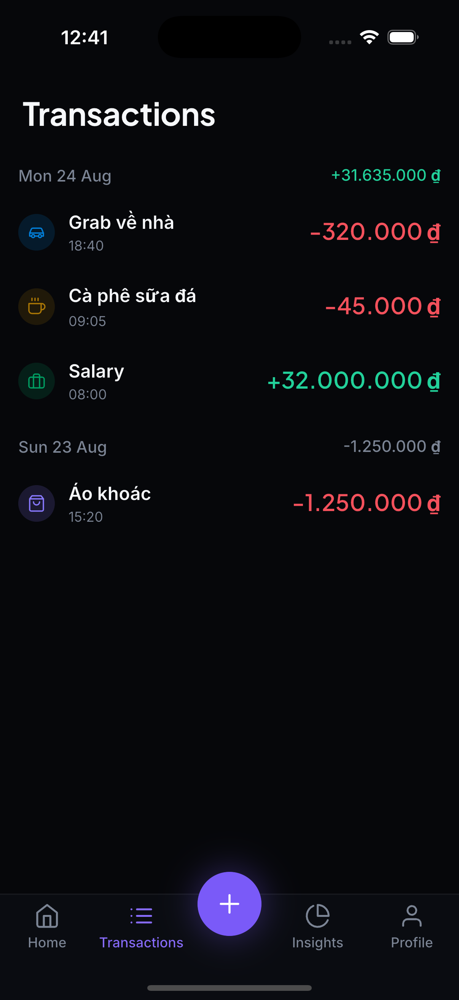

# Moneta

A personal finance app for iOS and Android. Record what you spend, see where it
went, and keep it all on your own device.



## Local-first

There is no account to create, no server to sign in to, and no network call to
make. The SQLite database on your phone is the only copy of your data, which means
the app works on a plane, in a lift, and on a bad connection — and that your
spending history is not sitting in someone else's datacentre.

The trade-off is deliberate and worth stating: no sync between devices, and no
backup beyond your phone's own.

## What it does today

**Transactions**

- Record an expense or income with an amount, a category, a date and an optional
  note.
- See everything grouped by day, newest first, with each day's net alongside its
  heading.
- Swipe a row away to delete it, with a few seconds to undo.
- Amounts are exact. Money is stored as whole đồng — never as a floating-point
  number — so the totals you see are the totals that were recorded.

**Eight categories**, each with a fixed colour and glyph: food and drink,
transport, shopping, bills, health, entertainment, salary and gifts. A category
looks the same everywhere it appears, so you can read a list by colour alone.

**Vietnamese đồng** formatting throughout (`1.250.000 ₫`), with the number
grouping and symbol placement the locale expects.

## Not built yet

Being honest about this, because the bottom navigation shows four tabs:

| | Status |
| --- | --- |
| Transactions | Working |
| Home | Placeholder — the balance overview is designed but not wired up |
| Insights | Placeholder — no charts yet |
| Profile | Placeholder |

Also absent: budgets (the card exists, nothing stores a limit), multiple accounts,
editing a recorded transaction, search, export, recurring transactions, and any
currency other than VND.

## Running it

Requires [Flutter](https://docs.flutter.dev/get-started/install) 3.44 or newer.

```bash
flutter pub get
flutter run
```

There is also a gallery of every UI component at the `/gallery` route, which is
the quickest way to see the design system without clicking through the app.

## Tests

```bash
flutter test
```

485 tests, none of which need a simulator — the database layer runs against
SQLite on the desktop VM.

## How it is built

Flutter and Dart, with [Riverpod](https://riverpod.dev) for state,
[go_router](https://pub.dev/packages/go_router) for navigation, and
[sqflite](https://pub.dev/packages/sqflite) for storage. The interface is built
from a design system derived from Figma rather than assembled screen by screen, so
a colour or a text style is defined once.

| Path | Contents |
| --- | --- |
| `lib/core` | Pure Dart, no Flutter: `Money`, `Result`, `Clock`, `SpendCategory` |
| `lib/data` | Database, schema migrations, shared DAO code |
| `lib/design_system` | Design tokens, theme, and the widgets built from them |
| `lib/features/<name>` | One folder per feature: `domain/`, `data/`, `presentation/` |
| `lib/app` | Router, theme wiring, component gallery |

Layer boundaries are enforced by a script rather than by convention — `core` may
not import anything above it, and two features may not import each other.

## Licence

Not yet licensed. The bundled fonts (Inter, Plus Jakarta Sans) are under the SIL
Open Font License 1.1; see `assets/fonts/README.md`.
