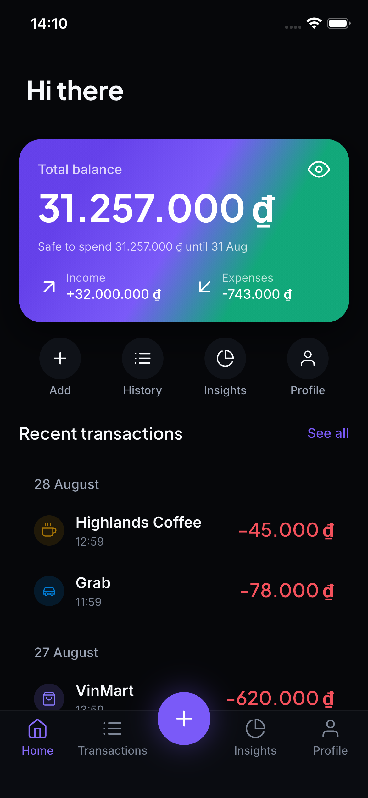
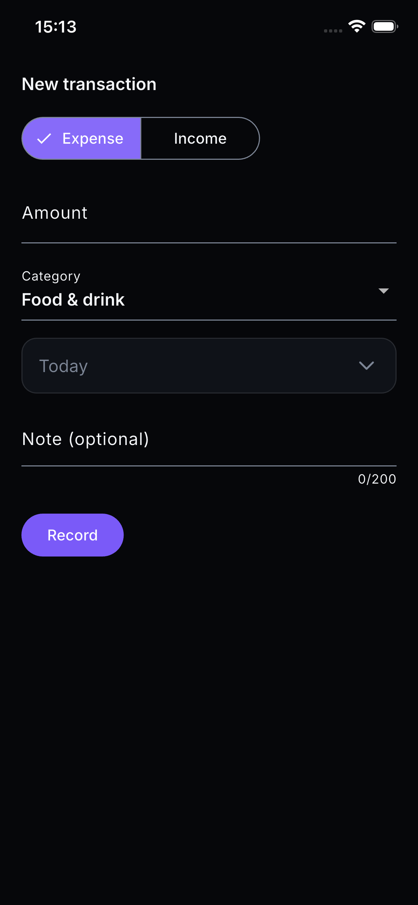

# Moneta

A personal finance app for iOS and Android. Record what you spend, see where it
went, and keep it all on your own device.

  

---

## Local-first

There is no account to create, no server to sign in to, and no network call to
make. The SQLite database on your phone is the only copy of your data, which
means the app works on a plane, in a lift, and on a bad connection — and that
your spending history is not sitting in someone else's datacentre.

The trade-off is deliberate and worth stating plainly: **no sync between
devices, and no backup beyond your phone's own.** If you lose the phone, you
lose the data.

---

## What it does today

### Transactions

- Record an expense or income with an amount, a category, a date and an optional
  note.
- See everything grouped by day, newest first, with each day's net beside its
  heading.
- Swipe a row away to delete it, with five seconds to undo.
- The amount pad groups digits as you type (`1.250.000`) and shows the currency
  alongside.
- **Amounts are exact.** Money is stored as whole minor units — never as a
  floating-point number — so the totals you see are the totals that were
  recorded.

### Home

A dashboard: current balance, a safe-to-spend figure, budget progress, and the
five most recent transactions. It greets you by the first name on your profile,
and falls back to `Hi there` when it doesn't have one. Separate designs for the
empty, loading and over-budget states are all implemented.

### Budgets

Per-category monthly limits with progress against them, an on-track and an
over-limit detail view, and a two-step create flow (pick a category, then set an
amount). Budget history is not built — it needs a bar chart component that has
not been pulled from Figma yet.

### Insights

An overview with a donut of spending by category, a cash-flow trend line, a
category breakdown in bars, and a period picker. Both charts carry their legends
as part of the component rather than as an option, because several of the chart
colours fall below 3:1 contrast against the dark surface — the visible labels
*are* the contrast relief.

### Profile and settings

Profile with usage stats, edit profile, a settings list, notification
preferences wired to the real notification feed, category usage, a premium
paywall that renders honestly (nothing is purchasable and the screen says so),
and a searchable help/FAQ — the search folds Vietnamese diacritics, so `tien`
finds `tiền`.

### Notifications

Derived from your own data rather than pushed from anywhere — there is no push
infrastructure, and nothing is stored. Three kinds: a budget passing its limit,
income arriving, and a budget period about to end. The first two open something;
the third is informational, because there is nothing to do about a date.

### Onboarding and auth

A splash, a three-slide introduction shown only on first run, and the full set
of sign-up / log-in / OTP / password-reset / setup screens.

**The auth screens authenticate nobody.** This is worth being precise about:
`📱 01 Onboarding & Auth` is designed around email, passwords and social
sign-in, all of which assume a server, and Moneta has none. `AuthService` exists
to keep that fact in one place instead of spreading it across eight screens; its
only implementation, `LocalAuthService`, validates the *shape* of what you typed
and records locally that setup is done. No credential is transmitted, stored, or
checked against anything — there is nothing to check it against. If a backend
ever appears, it implements that interface and the screens do not change.

### Money and currencies

Two currencies are modelled — **VND** (no minor unit, `1.250.000 ₫`) and **USD**
(two decimals, `$1,250.00`) — each with its own grouping separator, decimal
separator and symbol placement. Parsing is locale-aware and guards against
int64 overflow. The wallet itself is still single-currency: you cannot hold
balances in two currencies at once, which is what blocks the currency settings
screen.

---

## What is not built

Stated because the app looks more finished than it is.

| Area | Status |
| --- | --- |
| Editing a recorded transaction | Not built — you can add and delete only |
| Search over transactions | Not built |
| Multiple accounts / cards | Not built (page `05` of the design, untouched) |
| Savings goals | Not built (page `06`, untouched) |
| Budget history | Deferred — needs a `BarChart` component |
| Month comparison, export report | Deferred — `07.04`, `07.06` |
| Security settings, change PIN | Deferred — a PIN that gates nothing is worse than none |
| Currency & language screen | Deferred — needs a multi-currency wallet |
| Edit / rename / archive categories | Deferred — needs a category-override layer |
| Recurring transactions | Not built |
| Sync, backup, export | Not built, and not planned |

Screens implemented against the design file, by page:

| Figma page | Designed | Built |
| --- | --- | --- |
| `01 Onboarding & Auth` | 12 | 12 (auth is scaffolding — see above) |
| `02 Home & Dashboard` | 6 | 6 |
| `03 Transactions` | 14 | 2 — the list and the add sheet |
| `04 Budgets` | 7 | 6 |
| `05 Accounts & Cards` | 6 | 0 |
| `06 Goals` | 6 | 0 |
| `07 Insights & Reports` | 6 | 4 |
| `08 Profile & Settings` | 11 | 7 |
| `09 System States` | 6 | 0 |

Pages `03` and `09` have **never been read** — they appear in the file's screen
index and nowhere else in the map. The transactions screens were built before
the design pages were being read systematically, so how far they diverge from
`03` is genuinely unknown rather than known-and-accepted.

Every other deferral is recorded with its reason in
[`docs/design-system/figma-map.md`](docs/design-system/figma-map.md) rather than
left as silence.

---

## Running it

Requires [Flutter](https://docs.flutter.dev/get-started/install) **3.44** or
newer (built against 3.44.4, Dart SDK `^3.12.2`).

```bash
flutter pub get
```

```bash
flutter run
```

There is a gallery of every design-system component at the **`/gallery`** route
— the quickest way to see the whole system without clicking through the app. It
has sections for auth, budgets, home, insights and profile components.

---

## Tests

```bash
flutter test
```

**1,930 tests**, none of which need a simulator — the database layer runs
against SQLite on the desktop VM via `sqflite_common_ffi`. Line coverage was
**92.8%** at the last gate run (2026-09-11).

But `flutter test` is not what "verified" means here:

```bash
./tool/verify.sh
```

Eight gates, all of which must pass:

| Gate | What it checks |
| --- | --- |
| `timezone` | `TZ` is `Asia/Ho_Chi_Minh`, so local-time tests can actually discriminate |
| `format` | `dart format` produces no diff |
| `analyze` | `dart analyze --fatal-infos --fatal-warnings` |
| `architecture` | No layer-boundary violations (`tool/check_architecture.dart`) |
| `design-tokens` | No raw design values outside the token layer |
| `hooks` | Every workflow hook parses and exits cleanly on input it should ignore |
| `test` | The full suite |
| `coverage` | `lib/core`, every `*/domain/` and `*/data/` ≥ 85%; total ≥ 70% |

Each run writes an evidence file to `docs/ai-workflow/verify-runs/` — there are
219 of them.

Two gates are worth explaining, because both exist as a result of a bug that got
through:

- **The timezone pin.** Under UTC, a function that forgets `.toLocal()` returns
  the identical answer, and a "last local day" calculation done in UTC coincides
  with the correct one. Those tests cannot fail under UTC, and CI runs UTC by
  default. Pinning a zone ahead of UTC is what makes them able to fail.
- **The hooks gate.** These are the four hooks in `.claude/hooks/` that keep the
  workflow honest — one analyses every Dart file as it is written, another
  refuses to end a session that left `lib/` or `test/` modified without a
  passing gate run. A hook that crashes is indistinguishable from a hook with
  nothing to report, and one of them crashed on every single invocation for an
  entire change before this check existed.

---

## Architecture

```
lib/
  core/           pure Dart: Money, Result, Clock, SpendCategory.
                  Imports nothing from other layers.
  data/           database, migrations, preferences, shared DAO infrastructure.
  design_system/  tokens/ theme/ atoms/ molecules/ organisms/ — the only place
                  raw design values may appear.
  features/<f>/
    domain/       entities + repository interfaces. Depends on core only.
    data/         DAO + repository implementation.
    presentation/ screens, Riverpod controllers, feature-local widgets.
  app/            composition root: router, theme wiring, providers, gallery.
```

Boundaries are **machine-enforced** by `tool/check_architecture.dart`:

| Layer | May import |
| --- | --- |
| `core` | `core` |
| `data` | `core`, `data` |
| `design_system` | `core`, `design_system` |
| `features/<f>` | `core`, `design_system`, `data`, and its own feature |
| `app` | anything |

**Cross-feature imports are forbidden.** A screen that needs data from two
features does not import the other one — `lib/app/` wires them together. That is
why `lib/app/notification_providers.dart` exists: notifications are derived from
budgets and transactions, and `features/notifications` may import neither. The
reasoning is in [ADR 0004](docs/adr/0004-cross-feature-overview-screens.md).

### Non-negotiables

- **Money is never a `double`.** `lib/core/money.dart` holds integer minor
  units. A `double` amount anywhere in domain or data is a bug.
- **Repositories return `Result<T>`**; they do not throw for expected failures.
  Expected failures are `AppFailure(kind: storage | validation | notFound)`.
- **`DateTime` is stored and compared in UTC.** `Clock` is injected everywhere a
  time is read, so tests can pick the moment. Only `SystemClock` and the id
  generator's default argument call `DateTime.now()` at all.
- **No raw design values outside `design_system/tokens|theme`** — no
  `Color(0x…)`, `Colors.*`, inline `TextStyle(`, literal `EdgeInsets`, or
  `BorderRadius.circular(` with a number. Enforced by
  `tool/check_design_tokens.dart`; a genuine exception needs an inline
  `// design-token-ignore` and a reason.
- **Design-system widgets take domain types**, not pre-formatted strings.
- **Every Figma component's full variant set is implemented**, not only the
  variant the current screen happens to need.

### Storage

SQLite at schema **v3**, three tables — `transactions`, `settings`, `budgets` —
with forward-only numbered migrations. Opening a database *newer* than the app
is refused rather than migrated down, because migrating down loses data. The
choice of persistence layer is [ADR 0001](docs/adr/0001-local-persistence-layer.md).

---

## The design system

41 widgets across 43 files — 11 atoms, 22 molecules, 8 organisms — built from a
Figma file rather than assembled screen by screen, so a colour or a text style is
defined once and every screen reads the same one.

Tokens (colour, spacing, radii, typography, elevation, motion) are transcribed
from the file and their provenance recorded in
[`docs/design-system/figma-tokens.md`](docs/design-system/figma-tokens.md):
which values were read from a variable, which were measured off a node, and
which are ours. The motion tokens, for instance, are openly **not**
Figma-derived — the design file defines no easing, so those came from Material 3
and are flagged so a design review knows which numbers are ours to argue about.

Implemented nodes are tracked in
[`docs/design-system/figma-map.md`](docs/design-system/figma-map.md), along with
every deviation from the design and the reason for it.

One quirk of the source file worth knowing: it is a **training file**, and its
own cover claims it contains twelve deliberate mistakes. Implementing against it
has turned up likely candidates — a stat tile whose sample colours overspending
as good news, a progress ring whose typed label can contradict its own sweep.
*Candidates*, not confirmed: the file's answer key at `🔧 Utilities / Known
Deviations` has never been read, so whether the file intends these as its
planted errors is still open. Either way the code does the defensible thing and
the deviation is recorded with its argument.

---

## How this project is built

Every change goes through [OpenSpec](openspec/) before any code is written:

```
spec ──► discuss ──► plan ──► execute ──► verify ──► archive
 │          │          │         │          │          │
propose   spec-      tasks.md  checkpoint  tool/     archive
          auditor    review    per task    verify.sh
          (agent)                          + change-verifier
```

- **No edits to `lib/` without an active change.**
- **One commit per task**, each with its own passing gate run referenced in the
  commit message.
- Three review agents: `spec-auditor` (before implementation), `change-verifier`
  (before archiving), `figma-fidelity` (after any Figma-derived widget).
- **Archive only after `change-verifier` says ship.**

Seven changes are archived in [`openspec/changes/archive/`](openspec/changes/archive/);
several more are in flight.

### Tests that cannot fail

The recurring problem this workflow exists to catch is not code that breaks —
it's tests that pass for code with none of the claimed behaviour. Every task
therefore names a **mutation**: a specific way to break the code, and the test
that must fail when you do. Reviewers run them.

They find real things. A numpad test derived its expected grid from the widget's
own constant, so a pad painting `6 5 4` passed all 1,724 tests. A three-state
screen test pumped a structurally identical tree three times, which reuses the
first `ProviderScope` — so every case after the first silently asserted against
the first case's data.

The running record of what was caught, how, and what it cost is in
[`docs/ai-workflow/evidence-log.md`](docs/ai-workflow/evidence-log.md). Mistakes
are recorded there rather than tidied away; a change that shipped an invented
string is more useful written down than quietly fixed.

---

## Repository layout

| Path | Contents |
| --- | --- |
| `lib/` | 160 Dart files, ~24,900 lines |
| `test/` | 138 files, ~32,400 lines — more test than source |
| `tool/` | The verification gate and its five checkers |
| `openspec/` | Specs, active changes, and the archive |
| `docs/adr/` | Four architecture decision records |
| `docs/design-system/` | Figma map, token provenance, device screenshots |
| `docs/ai-workflow/` | Evidence log, gate runs, audits |

---

## Built with

[Flutter](https://flutter.dev) and Dart, [Riverpod](https://riverpod.dev) for
state, [go_router](https://pub.dev/packages/go_router) for navigation,
[sqflite](https://pub.dev/packages/sqflite) for storage,
[intl](https://pub.dev/packages/intl) for formatting, and
[flutter_svg](https://pub.dev/packages/flutter_svg) for icons.
